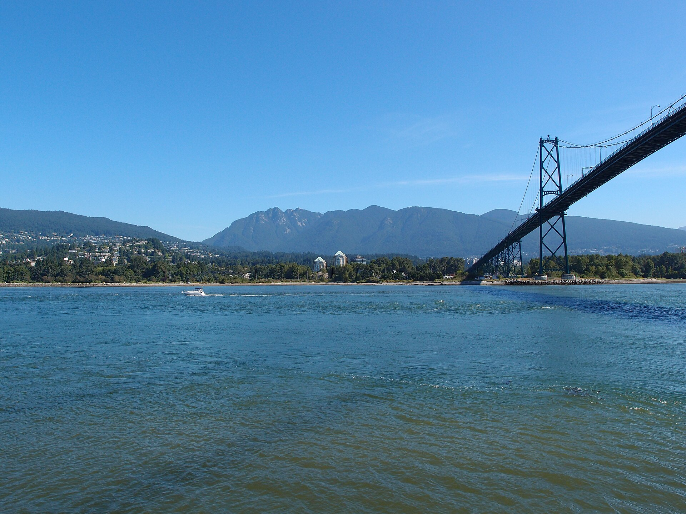

Dieser Beitrag ist eine lokale Bildprobe. Er zeigt, wie eine Geschichte mit einem großen Titelbild
beginnt und später durch ein weiteres Foto aufgelockert werden kann. Inhaltlich ist hier noch nicht
viel passiert. Immerhin sehen die Platzhalter schon so aus, als hätten sie Reisepläne.

## Der Auftakt als große Bühne

Das Titelbild gehört zum Kopf des Beitrags. Es schafft Atmosphäre, bevor der eigentliche Text
beginnt. Eine kurze Bildunterschrift und der Bildnachweis stehen direkt darunter.

## Ein Bild mitten in der Geschichte

Ein Foto im Text kann einen neuen Gedanken eröffnen oder eine Beobachtung greifbarer machen. Es
sollte nicht nur Platz füllen. Im echten Beitrag könnte hier ein Moment vom ersten Spaziergang,
ein besonderes Essen oder eine überraschende Ecke der Stadt stehen.

_Stanley Park und Lions Gate Bridge. Foto: [Guilhem Vellut](<https://commons.wikimedia.org/wiki/File:Stanley_Park_%40_Vancouver_(7718587616).jpg>), [CC BY 2.0](https://creativecommons.org/licenses/by/2.0/deed.de)._

Nach dem Bild geht der Text ohne einen harten Bruch weiter. Auf dem Handy nimmt das Foto die
verfügbare Breite ein. Auf einem großen Bildschirm bleibt es nah am Text und unterbricht den
Lesefluss nicht unnötig.

## Was daraus später werden kann

Für eigene Reisebeiträge reicht diese einfache Form meistens aus. Wenn später Galerien,
Stimmungsanzeigen oder kleine Karten dazukommen sollen, können wir dafür gezielte Astro
Komponenten ergänzen. Bis dahin bleibt das Schreiben angenehm unkompliziert.
