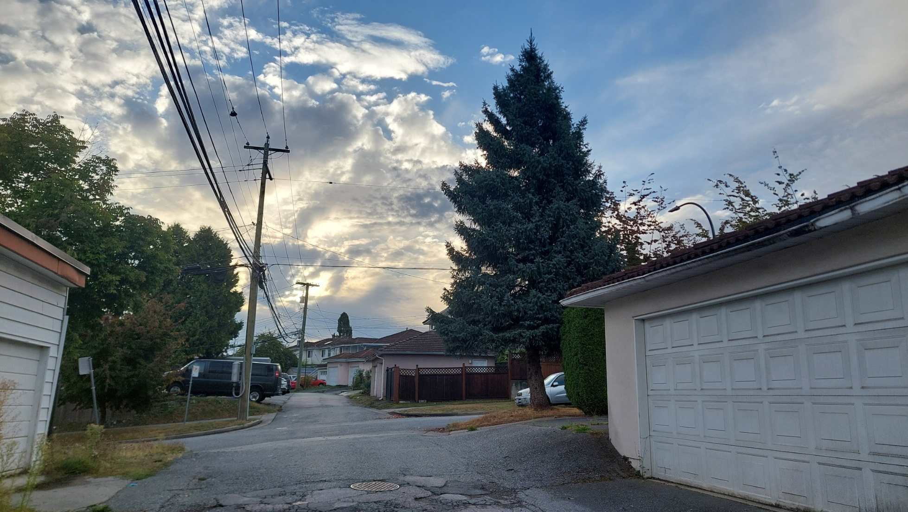
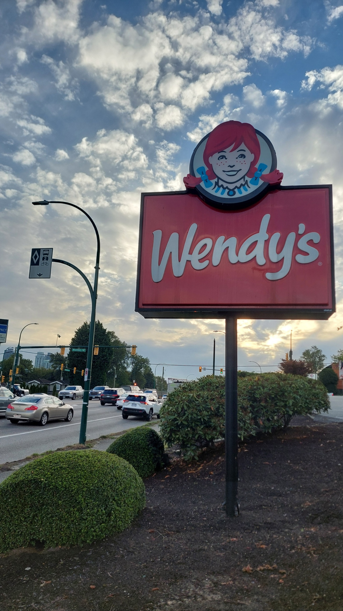
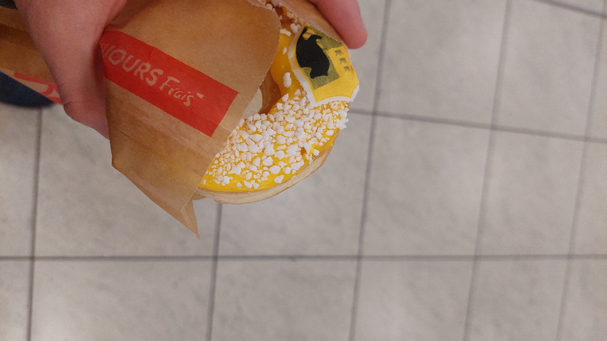
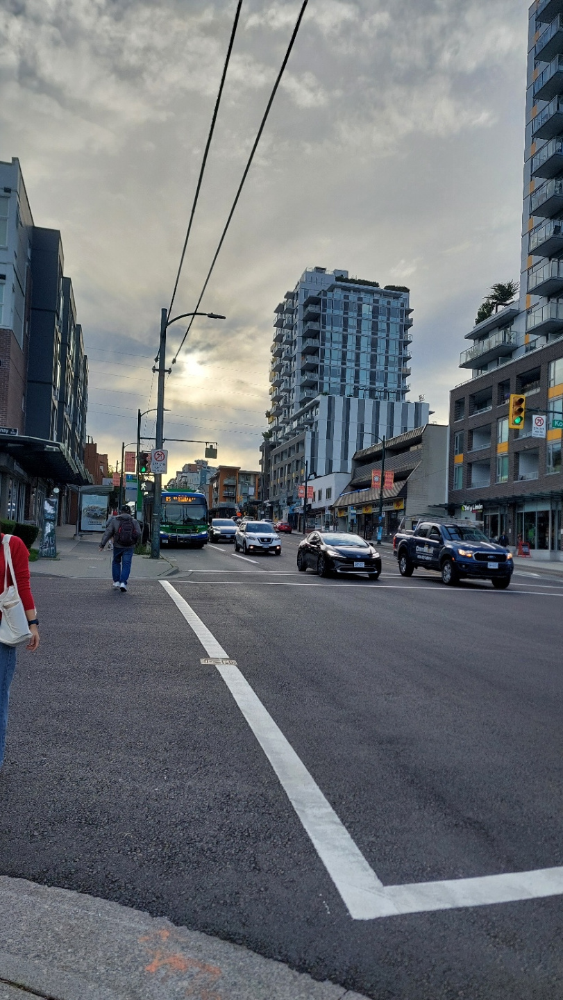
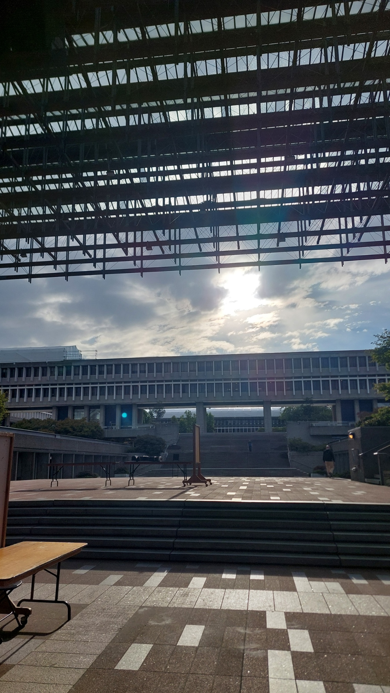
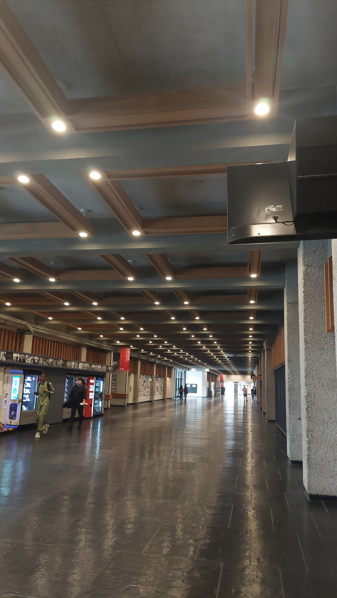
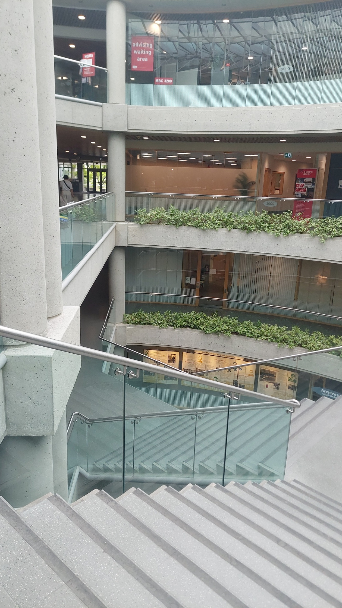
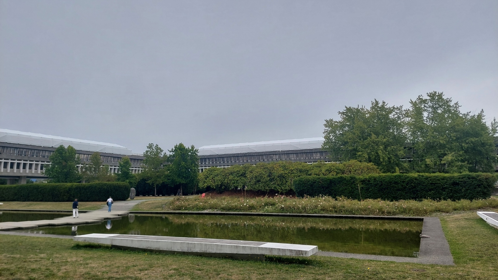
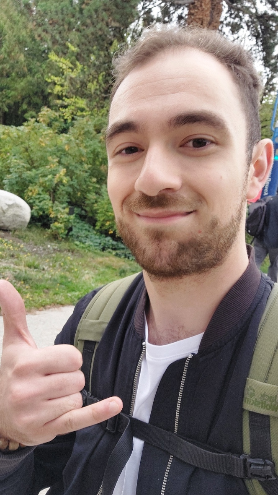
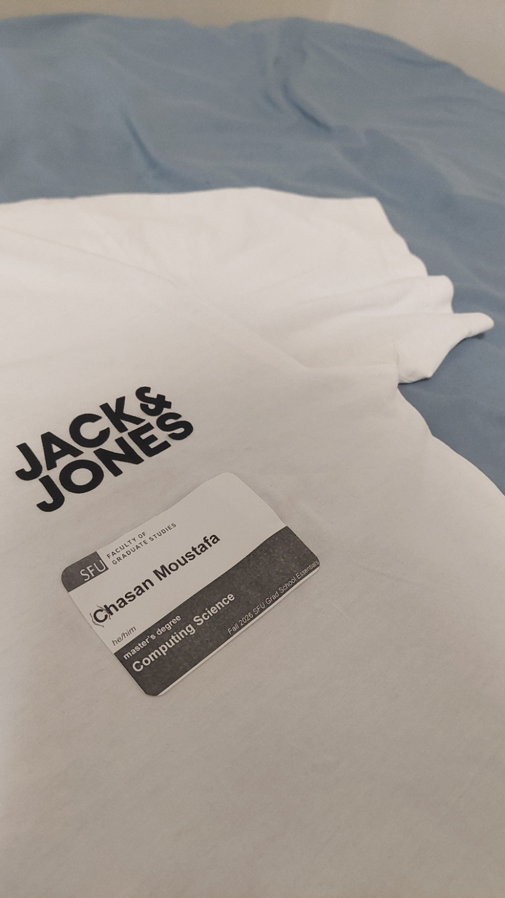

Nach ungefähr 30 Stunden auf den Beinen hatte ich endlich geschlafen. Gut sogar. Nur leider nicht besonders lange.

Um 6:45 Uhr stand ich wieder auf. Gut fünf Stunden Schlaf waren es geworden. Mein Körper hätte vermutlich noch ein paar weitere genommen, aber an diesem Morgen wartete bereits mein erster Tag an der Simon Fraser University auf mich. Der Graduate Orientation Day, eine Einführungsveranstaltung für neue Masterstudierende und Promovierende.

Gestern war ich noch mit einem Koffer durch Gießen gerannt. Heute wollte ich herausfinden, wie man mit dem Bus auf einen kanadischen Berg kommt, auf dem eine Universität steht.

Ein ziemlich schneller Wechsel, muss ich sagen.

## Navigation mit Screenshots

So richtig eingerichtet war ich natürlich noch nicht. Ich war schließlich erst in der Nacht angekommen. Weder hatte ich etwas zum Frühstücken da, noch eine kanadische SIM-Karte für mobile Daten.

Immerhin hatte ich mir am Vorabend noch eine Verbindung zur SFU herausgesucht. Ein bisschen Vorbereitung war also vorhanden. Nur der Teil mit dem Internet unterwegs hatte in meinem Plan offenbar noch gefehlt.

Als ich morgens losging und Google Maps wieder öffnete, lud die App langsamer und langsamer. Irgendwann passierte gar nichts mehr.

Ach ja. Kein WLAN mehr.

Also nochmal zurück. Bis auf ungefähr zehn Meter ans Haus heran, wo mein Handy wieder eine Verbindung fand. Dort suchte ich die Busverbindungen heraus und machte Screenshots. Haltestelle, Buslinie, Umstieg. Vorsichtshalber auch gleich den Rückweg von der SFU. Ich wusste schließlich noch nicht, ob ich dort eduroam oder überhaupt irgendein Internet haben würde.

Mit meiner frisch angelegten Sammlung an Bildschirmfotos ging ich dann auf gut Glück wieder los. Und wurde von diesem Blick begrüßt:

_Der erste Morgen in Kanada. Für diesen Empfang hatte sich das frühe Aufstehen schon gelohnt. Eigenes Foto._

Ein paar Wolken, die Sonne dahinter, die Häuser und die vielen Leitungen über der Straße. Eigentlich nichts besonders Spektakuläres. Und trotzdem blieb ich kurz stehen.

Das hier war jetzt der Weg, auf dem mein neuer Alltag begann.

## Frühstück mit Aussicht auf Wendy's

Eine Frage blieb allerdings noch offen: Was frühstücke ich eigentlich?

Glücklicherweise hatte ich am Abend davor schon gesehen, dass auf meinem Weg zum Bus ein Wendy's lag. Den Namen kannte ich. In einem gewesen war ich noch nie. Das ließ sich an diesem Morgen ziemlich praktisch ändern.

Schon das Schild bekam seinen eigenen kleinen Auftritt im Morgenlicht.

_Mein erstes Frühstück in Kanada hatte zumindest schon mal ein imposantes Schild. Eigenes Foto._

Wobei ich beim Thema Essen noch eine kleine Sache vom Vortag nachreichen muss. Mein erster Snack auf kanadischem Boden war nämlich schon in Calgary fällig gewesen. Und wie es sich für einen selbstverständlich vollkommen traditionellen Einstieg in Kanada gehört, war es ein Harry Potter™ Doughnut von Tim Hortons. (No Sponsoring).

Mit Hufflepuff darauf und mit Zitrone und Baiser gefüllt. Ich war noch nicht einmal in Vancouver angekommen, hatte mich kulinarisch aber offenbar schon in Hogwarts eingeschrieben.

_Der erste Snack in Kanada. Tim Hortons, Hufflepuff und eine ziemlich gelbe Begrüßung. Eigenes Foto._

Zurück zum Frühstück. Bei Wendy's holte ich mir ein Sausage Sandwich und einen Kaffee. Bei „Sausage“ denkt man als Deutscher vielleicht erstmal an eine Wurst. Hier lag allerdings ein flaches, gewürztes Fleischpatty im Brötchen. Eine Frühstückswurst in einer Form, die ich so noch nicht gewohnt war.

Mit Frühstück und Kaffee versorgt konnte es nun wirklich zum Bus gehen.

## „Kuck-kuck! Kuck-kuck!“

Um auf die andere Straßenseite zu kommen, drückte ich an der Ampel auf den Knopf. Die Fußgängerampel gab den Weg frei. Und plötzlich hörte ich es.

„Kuck-kuck! Kuck-kuck!“

Ähm ... lag das an meinen fünf Stunden Schlaf mit Jetlag oder hatte gerade tatsächlich die Ampel einen synthetischen Kuckuck von sich gegeben?

Tatsächlich. Es war die Ampel.

Die Geräusche sind eine Orientierungshilfe für blinde und sehbehinderte Menschen. Bei solchen Ampeln in Vancouver steht der Kuckuck typischerweise für eine Querung in Nord-Süd-Richtung, während es in Ost-West-Richtung zwitschert. Die Stadt beschreibt diese unterschiedlichen Töne in ihren [Vorgaben für barrierefreie Fußgängersignale](https://bids.vancouver.ca/bidopp/EOI/documents/PS20120654-RFEOI.pdf).

Auch in Deutschland gibt es akustische Ampelsignale. Aber diese kleine Vogelwelt an einer Straßenkreuzung war für mich neu.

Noch vor meiner ersten Busfahrt hatte ich also schon etwas gelernt. Und ein Geräusch gehört, bei dem ich kurz an meinem Wachzustand gezweifelt hatte.

Am Bus stand dann gleich die nächste Frage an:

„Hi, wie bezahle ich bei euch?“

Eine durchaus berechtigte Frage. Hier gibt es die sogenannte Compass Card. Eine aufladbare Karte für den Nahverkehr in Metro Vancouver. Mit aufgeladenem Guthaben sind die Fahrten günstiger als mit einem regulären Einzelticket. Außerdem lassen sich darauf Zeitkarten laden.

Für mich als Student kommt der U-Pass dazu. Damit kann ich Bus, SkyTrain und SeaBus nutzen, ohne jede Fahrt einzeln zu bezahlen. Ganz kostenlos ist das normalerweise nicht, denn der U-Pass wird über die Studiengebühren finanziert und muss monatlich auf der Karte aktiviert werden.

An diesem Morgen hatte ich allerdings weder die Karte noch einen darauf aktivierten Pass. Also hielt ich meine Kreditkarte an das Lesegerät. Das funktionierte zum Glück auch.

Und dann saß ich im Bus.

Ich glaube, ich war noch nie so glücklich über eine gewöhnliche Busfahrt. Häuser zogen an mir vorbei, hohe Gebäude, Autos und diese großen Trucks, die ich bisher vor allem aus Filmen kannte. Vieles sah einfach ein bisschen anders aus. Und ich saß mittendrin und schaute aus dem Fenster, als wäre die Fahrt selbst schon das Tagesprogramm.

An meinem Zwischenstopp musste ich noch einmal umsteigen.

_Einmal umsteigen. Danach ging es hinauf zur Universität. Eigenes Foto._

Noch eine Busfahrt den Burnaby Mountain hinauf, auf dessen Gipfel der [Burnaby Campus der SFU](https://www.sfu.ca/campuses/burnaby.html) liegt. Dann war ich tatsächlich da.

## Erstmal herausfinden, wo wir hinmüssen

Die Verbindung hatte also funktioniert. Jetzt musste ich nur noch den richtigen Ort auf dem Campus finden.

Zusammen mit einem anderen neuen Graduate Student versuchte ich erstmal herauszufinden, in welche Richtung wir überhaupt laufen mussten. Er kam aus Ghana und studierte im naturwissenschaftlichen Bereich. Zwei Menschen, die gerade erst angekommen waren, mit demselben Ziel und ungefähr derselben Orientierung.

Eine hervorragende Grundlage für einen ersten gemeinsamen Spaziergang.

Der Campus war riesig. Zum Glück lag unsere Bushaltestelle recht zentral. Trotzdem waren es bis zu unserem Treffpunkt noch ungefähr zehn Minuten zu Fuß. Und das war gerade einmal der Weg zu einer Veranstaltung, nicht von einem Ende der Universität zum anderen.

Unterwegs sah es dann so aus:

_Auf dem Weg zur ersten Veranstaltung. Hier würde ich wohl noch einige Male nach dem richtigen Gebäude suchen. Eigenes Foto._

Am Treffpunkt wurden wir mit Kaffee, Kuchen und anderem Gebäck begrüßt. Dazu gab es T-Shirts. In meiner richtigen Größe wäre schön gewesen, aber L war noch da. XL und XXL wären auch Optionen gewesen.

Ich nahm L. Ein bisschen Platz im T-Shirt schadet schließlich nicht.

Was mich an solchen Einführungsveranstaltungen immer wieder überrascht, ist, wie schnell man mit den verschiedensten Menschen ins Gespräch kommt. Alle sind neu. Alle versuchen irgendwie anzukommen. Und meistens reicht schon die Frage, was die andere Person studiert.

Eine Person beschäftigte sich zum Beispiel damit, wie Schadstoffe in Gewässern die dort lebenden Fische beeinflussen. Eine andere wollte von einem Musikstudium in die Entwicklung von Software für virtuelle Realität wechseln. Und später an diesem Tag würde ich noch Menschen kennenlernen, die Kriminologie studierten und sich fürs Profiling interessierten.

Fische, virtuelle Welten und die Frage, wie man kriminelles Verhalten versteht. Ich selbst war für Computing Science hier. So unterschiedlich konnten die Wege sein, die uns an diesem Morgen an denselben Ort gebracht hatten.

Zum Einstieg gab es eine Rede eines Dekans. Danach lernten wir die Angebote der Universität kennen.

Und man, waren das viele.

Da waren zum Beispiel die [International Services for Students](https://www.sfu.ca/students/iss/), die internationale Studierende beim Ankommen unterstützen und unter anderem bei Fragen zu Aufenthaltsdokumenten und Krankenversicherung weiterhelfen. Dazu kam die [Graduate Student Society](https://sfugradsociety.ca/Advocacy/individual-advocacy/), die Interessenvertretung der Masterstudierenden und Promovierenden. Sie setzt sich für ihre Mitglieder ein und bietet Unterstützung bei Problemen im Studium.

Von jeder Stelle führte gefühlt wieder ein Verweis zur nächsten. Ich hätte vermutlich eine Sammlung anlegen können, diesmal nur für die Frage, wer eigentlich wofür zuständig ist.

Immerhin wusste ich danach: Wenn später Fragen auftauchen, gibt es ziemlich viele Menschen, an die ich mich wenden kann.

## Eine Universität mit allem drum und dran

Nach einem Pizzalunch ging es auf Campustour. Wobei „Lunch“ beinahe ein bisschen zurückhaltend klingt. Die Portionen sind hier jedenfalls nicht klein.

Dann liefen wir los. Durch lange Gänge, über Treppen, zwischen Gebäuden und wieder durch die nächsten Gänge.

_Einer von vielen Wegen durch den Campus. Eigenes Foto._

Maaan. Ich hatte morgens schon gedacht, dass das hier groß war. Aber erst auf der Tour wurde mir langsam klar, wie viel auf diesem Berg eigentlich untergebracht ist.

Es gab einen Food Court mit verschiedenen Ständen für Essen zum Mitnehmen. Einen Freizeitbereich mit Billard, Airhockey und sogar Basketballautomaten, an denen man Körbe werfen konnte. Und einen Friseur.

Einen Friseur am Campus.

Habe ich erwähnt, dass es dort sogar einen Zahnarzt gibt?

Man konnte also studieren, essen, spielen, sich die Haare schneiden lassen und offenbar auch noch die Zähne kontrollieren lassen, ohne dafür erst wieder den Berg hinunterzufahren. Langsam verstand ich, warum mir der Campus so groß vorkam.

_Noch eine Treppe, noch eine Etage und noch etwas, das ich auf der ersten Runde nicht entdeckt hätte. Eigenes Foto._

Zwischen all den Gebäuden lagen außerdem offene Plätze, Grünflächen und Wasserbecken. Immer wieder kam man aus einem Gang heraus und stand plötzlich vor einem ganz anderen Blick.

_Ein bisschen Ruhe zwischen den Gebäuden. Mein neuer Campus hatte deutlich mehr zu zeigen, als ich erwartet hatte. Eigenes Foto._

Ich war erst seit ein paar Stunden hier. Aber ich konnte mir schon ziemlich gut vorstellen, in den kommenden Monaten immer wieder etwas Neues zu entdecken.

## Der Tag war noch nicht vorbei

Inzwischen war es Nachmittag. Die Veranstaltung ging zu Ende, aber einige von uns gingen anschließend noch gemeinsam in eine nahegelegene Bar.

Nach all den Informationen und der Campustour war das eine ziemlich gute Gelegenheit, einfach weiterzureden.

_Auf dem Weg zu den nächsten Gesprächen. Für fünf Stunden Schlaf war die Stimmung erstaunlich gut. Eigenes Foto._

Hier lernte ich dann auch die Leute aus der Kriminologie kennen. Einige interessierten sich fürs Profiling, also dafür, aus Verhalten und den Umständen einer Tat Hinweise auf mögliche Täter abzuleiten. Dass ich an meinem ersten Tag an der Universität direkt über solche Themen sprechen würde, hatte ich morgens jedenfalls noch nicht erwartet.

Irgendwann kamen wir auch auf künstliche Intelligenz zu sprechen. Besonders interessierte sie, wie ich als Computing-Science-Student auf das Thema blickte. Plötzlich war also auch mein eigenes Studiengebiet mitten im Gespräch angekommen.

Wir tauschten verschiedene Standpunkte aus, diskutierten Meinungen und versuchten zu verstehen, welche Gründe und Erfahrungen dahinterstanden. Ich erzählte von meiner Sicht auf KI und hörte mir ihre Perspektiven an. Gerade weil wir aus unterschiedlichen Fachrichtungen kamen, fand ich diesen Austausch ziemlich spannend.

Ein wirklich vernünftiges Gespräch. Offen, interessiert und mit Raum, auch mal nachzufragen. Schon erstaunlich, worüber man mit Menschen reden kann, die man erst seit ein paar Stunden kennt.

Die Stunden vergingen. Zwischen den Gesprächen sammelte ich ganz nebenbei eine Menge praktischer Tipps. Wie das mit der Compass Card funktioniert. Wo man gut einkaufen kann und wo es schnell teuer wird. Was ich mir in Vancouver unbedingt anschauen sollte. Und in welchen Gegenden man gerade als Neuankömmling lieber etwas aufmerksamer unterwegs ist.

Das waren genau die Fragen, für die ich noch keine richtigen Antworten hatte. Plötzlich saßen da Menschen, die sich schon auskannten und ihre Erfahrungen mit mir teilten.

Als die Sonne langsam tiefer stand, brachen wir nach und nach auf.

## Mit einem Handy voller neuer Kontakte nach Hause

Auf der Rückfahrt schaute ich nochmal auf mein Handy. Über den Tag hatte ich mich mit so vielen Leuten auf Instagram verbunden, dass ich beim Durchgehen der Profile die Gespräche gleich noch einmal vor Augen hatte.

Heute Morgen war ich mit ein paar Screenshots losgegangen, damit ich überhaupt den Weg finden konnte. Jetzt hatte ich neben einer Menge neuer Eindrücke auch schon die ersten Kontakte hier.

Draußen fiel das orange Licht der tief stehenden Sonne auf die hohen Gebäude. Ich schaute aus dem Fenster und ließ den Tag ein bisschen nachwirken.

Ganz fertig war er allerdings noch nicht. Ich ging noch schnell einkaufen und holte mir über Too Good To Go eine Pizza. Frühstück für den nächsten Morgen war damit zumindest kein vollständig ungelöstes Problem mehr.

Später zu Hause legte ich mein Namensschild auf ein T-Shirt und machte noch ein letztes Foto. Ein kleines Andenken an einen Tag, der morgens mit fehlendem Internet begonnen hatte und irgendwie ziemlich voll geworden war.

Mit einem Kuckuck an der Ampel. Mit meinem ersten Weg zur SFU. Mit Menschen, die an völlig unterschiedlichen Dingen arbeiteten. Und mit dem Gefühl, hier schon nach einem Tag ein kleines bisschen angekommen zu sein.

Wenn mein Leben in Kanada so weitergeht, habe ich jedenfalls nichts dagegen, noch eine Weile zu bleiben.

_Mein Namensschild nach dem ersten Tag. Ein kleines Stück Ankommen zum Mitnehmen. Eigenes Foto._

## Immer auf dem Laufenden

Wenn du keinen neuen Eintrag verpassen möchtest, kannst du diesem Blog über [RSS](/rss/) folgen
oder mich auf [Instagram](https://www.instagram.com/kamivantoad/) begleiten.
