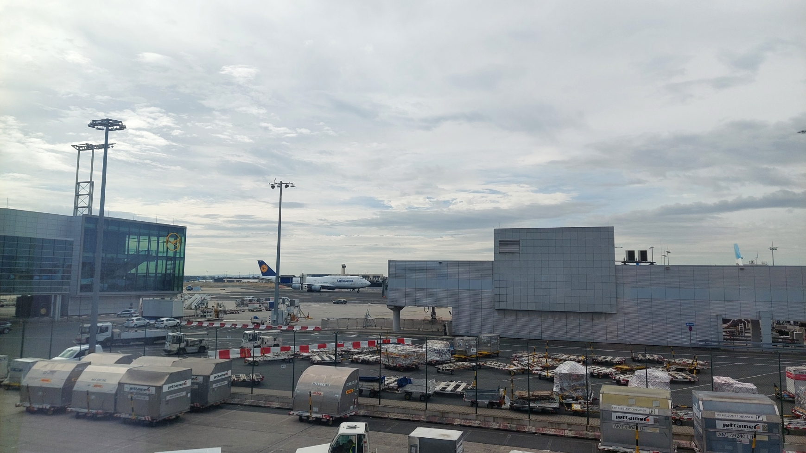
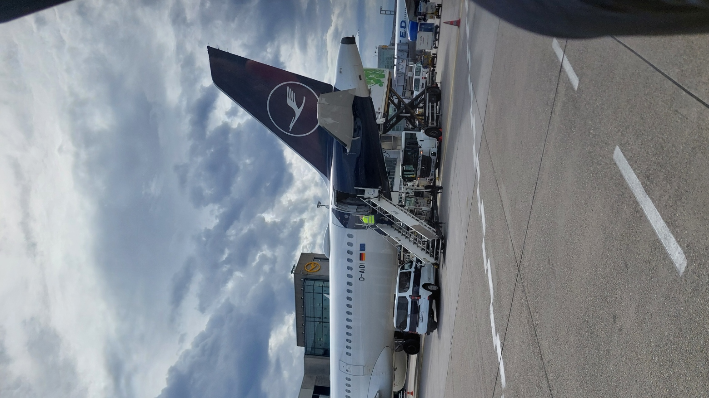
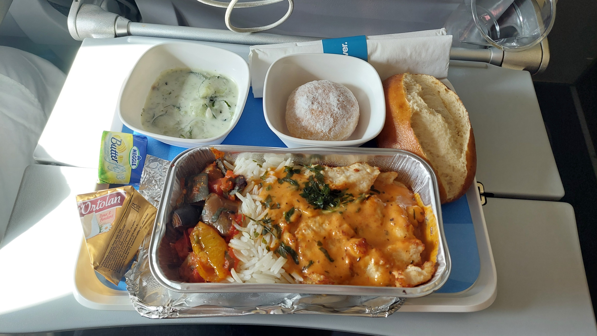
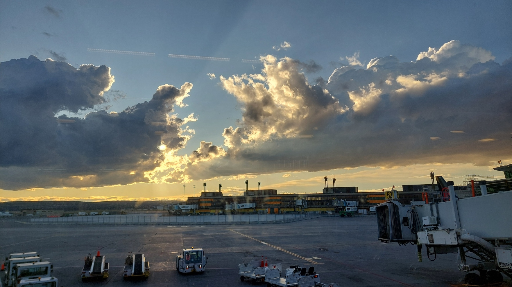
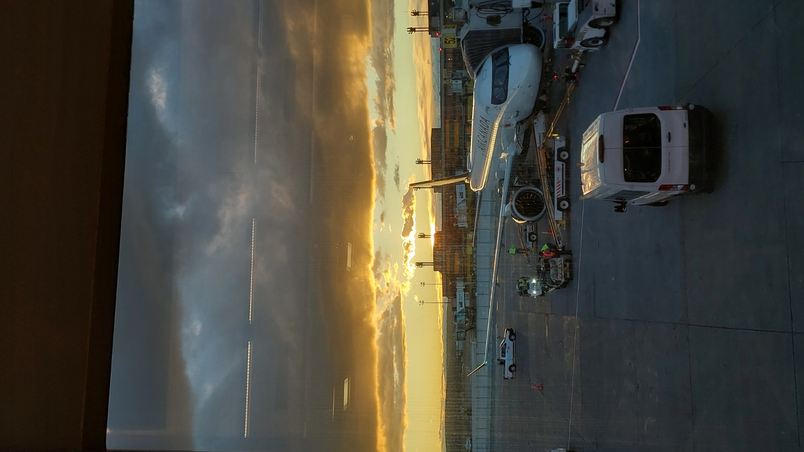
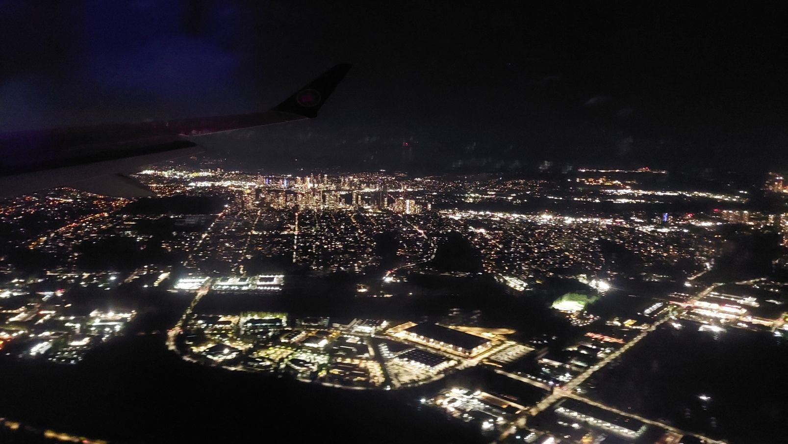

> "And suddenly you know: It’s time to start something new and trust the magic of beginnings." ~ Meister Eckhart

Eine Reise beginnt nicht erst, wenn das Flugzeug abhebt. Sie beginnt in dem Moment, in dem sich alles gleichzeitig vertraut und vorläufig anfühlt. Es ist 6 Uhr morgens. Der Koffer ist gepackt. Die wichtigsten Dokumente sind zum dritten Mal kontrolliert ... vielleicht auch zum vierten Mal? Ich habe das Zählen inzwischen aufgegeben.

Nach monatelanger Vorbereitung sollte es nun endlich losgehen. Mein Auslandssemester in Kanada stand unmittelbar bevor. Doch wie es sich für eine ordentliche Reise gehört, verlief natürlich nicht alles ganz nach Plan.

## Eine unerwartete Rettung in Gießen

Die letzten Vorbereitungen meines Zimmers für meinen Nachmieter hatten doch etwas mehr Zeit in Anspruch genommen als gedacht. Als ich endlich die Wohnung verließ, war ich bereits später dran als geplant.

Mit einem 21,5 Kilogramm schweren Koffer, einem großen Rucksack und einem Tagesrucksack machte ich mich auf den Weg zum Gießener Bahnhof. Und weil ich schließlich nach Kanada reiste, war ich natürlich auch noch mit Winterjacke, Schal und Winterstiefeln ausgestattet.
Eine hervorragende Kombination, um mit seinem gesamten Hab und Gut durch die Stadt zu rennen.

Die Zeit wurde knapp. Sehr knapp.

Während ich mit meinem Gepäck durch Gießen eilte und trotz halbem Optimismus innerlich schon damit rechnete, meinen Zug zu verpassen, fuhr plötzlich eine Frau mit einem Lastenrad an mir vorbei.
Sie bemerkte offenbar meine etwas verzweifelte Situation und bot mir kurzerhand an, meinen Koffer und Rucksack auf ihrem Rad mitzunehmen. Meine Rettung!

Wir hievten mein Gepäck auf das Lastenrad und machten uns gemeinsam auf den Weg zum Bahnhof. Sie mit ihrem Rad, ich nebenher zu Fuß. Glücklicherweise musste sie ohnehin in dieselbe Richtung. Ohne mich zu kennen, hatte sie einfach angehalten und mir geholfen. Eine wahre Samariterin in genau dem Moment, in dem ich sie brauchte.

Dank ihr schaffte ich es noch rechtzeitig zum Bahnhof und konnte meine Reise wie geplant fortsetzen. Damit hatte ich schon eine ziemlich schöne erste Geschichte für ein Auslandssemester: Noch bevor ich Deutschland überhaupt verlassen hatte, erinnerte mich eine völlig fremde Person daran, wie viel eine kleine Geste ausmachen kann.

**Danke, Theresa!**

## Abschied am Flughafen

Nach diesem etwas turbulenten Start ging es zum Glück deutlich entspannter weiter.

Am Flughafen wurde aus der langen Vorbereitung schließlich Bewegung. Menschen kamen an, andere verschwanden hinter den Kontrollen. Überall rollten Koffer, wurden Abschiede gefeiert und begann für irgendjemanden eine neue Reise.
Mein guter Freund Daniel hatte mich netterweise noch zum Flughafen begleitet.
Eben noch gemeinsam meinen Koffer aufgegeben, dann stand auch schon die Passkontrolle bevor. Ein letzter Abschied, der Scan meines Reisepasses und plötzlich lag das letzte vertraute Gesicht hinter mir. Ab diesem Moment wusste ich: Mein Vorhaben wird jetzt tatsächlich Realität.

Ich kam mit einem deutschen Paar ins Gespräch, das mir ein paar Empfehlungen für Vancouver geben konnte. Später unterhielt ich mich vor dem Gate mit einem afghanischen Studenten, der in Kanada seinen Bachelor in Informatik absolvieren möchte. Ein finnischer Student erzählte mir außerdem, dass er für ein Praktikum nach Calgary reisen würde, mein Zwischenstopp auf dem Weg nach Vancouver.
Drei Menschen, drei unterschiedliche Geschichten und drei ganz eigene Gründe, nach Kanada zu reisen. Und mittendrin ich, auf dem Weg in mein Auslandssemester.

Wie es sich für den typischen deutschen Reisenden gehört, war ich übrigens schon dreieinhalb Stunden vor Abflug am Flughafen angekommen. Eine halbe Stunde früher, als ich überhaupt mein Gepäck aufgeben konnte. Das Warten vor dem Gate verging wie im ... na ja, erstaunlich schnell. Wahrscheinlich lag es an der Mischung aus Reiseeuphorie und den interessanten Gesprächen. Langeweile während des Wartens? Fehlanzeige.

Draußen warteten Flugzeuge, Gepäckwagen und all die kleinen Abläufe, die dafür sorgen, dass aus einem Plan tatsächlich eine Reise wird.

_Ein letzter Blick auf das geschäftige Vorfeld. Eigenes Foto._

Vor dem Abflug fühlte sich Vancouver noch eher wie eine Idee an. Ich kannte keine Bilder, Orte, gar Straßennamen aus Karten. Doch zwischen dem Lesen über einen Ort und dem tatsächlichen Flug dorthin liegt ein erstaunlich großer Unterschied.

Als das Flugzeug vor mir stand, wurde die Reise zum ersten Mal richtig greifbar. Plötzlich ging es nicht mehr um Packlisten, organisatorische Fragen oder offene Aufgaben. Es ging nur noch darum, einzusteigen.

Ein neues Kapitel im Buch meines Lebens zu beginnen.

_Mein Transportmittel ins weite, weite Land. Eigenes Foto._

Manche Reisen beginnen mit einem großen Abenteuer. Meine begann mit einer unerwarteten Rettungsaktion, reichlich Gepäck und anschließend erstaunlich viel unbemerktem Warten.

## 6 Jahre seit meinem letzten Flug ...

...und trotzdem fühlte es sich zugleich vertraut und neuartig an.
Ich setzte mich an meinen Platz. Nach einer kleinen Verzögerung hörte ich schließlich die Düsen aufheulen. Das Flugzeug begann zu rollen. Dann wurden die Triebwerke lauter und lauter. Mit einer immensen Kraft beschleunigte die Maschine über die Startbahn. Ich spürte, wie meine innere Aufregung und Vorfreude immer größer wurden.

Und dann... waren wir in der Luft.

Sechs Jahre war es her, dass ich Frankfurt das letzte Mal aus der Vogelperspektive gesehen hatte.
Jetzt saß ich wieder in einem Flugzeug. Diesmal auf dem Weg in ein anderes Land, in dem ich die kommenden Monate leben und studieren würde. Kurz darauf kam schon das erste Essen. Kein spektakulärer Teil der Reise, aber gerade deshalb gehört er für mich zu diesen Erinnerungen dazu. Ein Tablett, ein enger Sitzplatz und das sichere Wissen, dass ich meinem Ziel mit jeder Minute näherkam.

_Passend zum Flug nach Kanada gab es Hähnchen-Gyros mit Zaziki und einem Berliner. Eigenes Foto._
Während des Fluges gen Westen blieb es die gesamte Zeit hell.
Mein Körper hat sich natürlich tierisch darüber gefreut, dass um zwei Uhr morgens nach deutscher Zeit noch immer die Sonne schien...

## Der erste Sonnenuntergang in Kanada

Um 16 Uhr Ortszeit kam ich bei meinem Zwischenstopp in Calgary an. In Deutschland war es zu diesem Zeitpunkt bereits Mitternacht. Ich war inzwischen seit ungefähr 18 Stunden wach. Aber hey, zum ersten Mal stand ich auf kanadischem Boden! Auch wenn es vorerst nur ein Flughafen war, fühlte sich das schon ziemlich besonders an.

Später tauchte die Sonne das Vorfeld in ein Licht, das fast zu dramatisch für einen gewöhnlichen Reisetag wirkte. Dunkle Wolken lagen über dem Flughafen. Dazwischen brach die Sonne hervor und ließ für ein paar Minuten alles golden erscheinen.

Schöner hätte ich mir meine erste Ankunft in Kanada kaum vorstellen können.

_Ein kurzer Moment zwischen Wolken, Licht und der nächsten Etappe. Eigenes Foto._

Solche Zwischenstopps gehören zum Reisen genauso wie das eigentliche Ziel. Man ist nicht mehr dort, wo man gestartet ist, aber auch noch nicht wirklich angekommen. Nicht ganz.
Der Flughafen wird für eine Weile zu einem eigenen kleinen Ort. Alles ist auf Weiterreise eingestellt.

Als draußen das nächste Flugzeug vorbereitet wurde, sank die Sonne weiter. Die Müdigkeit war längst da, sie kämpfte gegen die Euphorie, obwohl das viele Koffein vom Morgen noch immer seinen guten Dienst leistete.
Zu diesem Zeitpunkt war ich schon ungefähr 22 Stunden wach.
Gleichzeitig wurde die Vorfreude größer.

Nur noch eine letzte Etappe.

_Die letzte Etappe im Abendlicht. Eigenes Foto._

## Ein strahlendes Vancouver

Allmählich wurde es dunkel.
Ich saß in meinem letzten Flieger, der mich nach Vancouver bringen sollte. In die Stadt, die für die kommenden Monate mein neues Zuhause werden würde.
Unter dem Flugzeug war zunächst nicht viel zu erkennen.
Dann erschienen die ersten Lichtpunkte.

Einzelne Straßen, Häuser und schließlich ganze Viertel. Immer mehr Lichter wurden sichtbar, bis sich eine riesige Stadt unter mir ausbreitete.
Von oben wirkte Vancouver ruhig und geordnet, obwohl dort unten vermutlich einfach ein ganz normaler Abend weiterging.
Menschen kamen von der Arbeit nach Hause, gingen einkaufen oder trafen sich mit Freunden.
Und irgendwo zwischen all diesen Lichtern würde bald auch mein eigener Alltag stattfinden.

_Die ersten Lichter Vancouvers. Mein neues Zuhause für die kommenden Monate. Eigenes Foto._

In diesem Moment änderte sich etwas.
Vancouver war nicht länger nur ein Ziel auf einem Bildschirm. Nicht mehr bloß eine Stadt, über die ich gelesen oder deren Lage ich auf Google Maps betrachtet hatte: Sie lag tatsächlich unter mir.

Nach all den Monaten der Vorbereitung, den organisatorischen Fragen, den Dokumenten, der Wohnungssuche und der Reiseplanung war ich nur noch wenige Minuten davon entfernt, zum ersten Mal selbst durch ihre Straßen zu gehen. Ein ziemlich unwirkliches Gefühl muss ich sagen...

## "Ladies and Gentlemen, we just arrived in Vancouver"

Ankommen passiert nicht in einem einzigen Augenblick.
Das Flugzeug landet. Die Türen öffnen sich. Man folgt den Schildern, wartet auf den Koffer und versucht gleichzeitig, trotz der Müdigkeit wach und aufmerksam zu bleiben.
Nach einem so langen Reisetag funktionierte vieles inzwischen eher auf Autopilot.

Auch nach der Einreise fühlte sich noch nicht alles sofort real an.
Dafür war der Tag zu lang und die Umgebung zu neu.
Aber draußen wartete eine Stadt, die in den kommenden Monaten langsam vertrauter werden sollte.
Eine Stadt, in der ich studieren, neue Menschen kennenlernen, unbekannte Orte entdecken und hoffentlich eine ganze Menge erleben würde.

Meine erste Erkenntnis aus Vancouver war deshalb überraschend einfach:
Eine große Reise kann sich am Ende ganz leise anfühlen.
Kein dramatischer Filmschnitt, keine perfekte Musik im Hintergrund. Nur ein Koffer, viele neue Eindrücke und das Gefühl, endlich da zu sein.
Wenn ich an den Beginn dieses Tages zurückdenke, muss ich allerdings ein wenig schmunzeln. Noch am Morgen war ich mit meinem gesamten Gepäck durch Gießen gerannt und hatte befürchtet, nicht einmal meinen ersten Zug zu erwischen.

Und jetzt? Jetzt war ich tatsächlich auf der anderen Seite des Atlantiks angekommen.

Nachdem ich mich noch ein wenig mit meinen neuen Mitbewohnern unterhalten hatte, zeigte die Uhr bereits 23:30 Uhr Ortszeit. Gegen 0:30 Uhr lag ich schließlich im Bett. Zu diesem Zeitpunkt war ich seit ungefähr 30 Stunden wach. Mein Körper hatte vermutlich längst aufgegeben, herauszufinden, in welcher Zeitzone er sich eigentlich befand.

Viel Zeit zum Ausschlafen blieb allerdings nicht. Schon am nächsten Morgen stand mein erster Graduate Orientation Day an der Simon Fraser University an. Ich wollte mich mit dem Campus vertraut machen, den Weg zur Universität kennenlernen und natürlich auch die ersten neuen Kontakte knüpfen. Mit dem Jetlag im Gepäck war Schlaf deshalb dringend nötig.
Ein letzter Gedanke, bevor ich die Augen schloss: Nach all den Monaten der Vorbereitung war ich endlich hier.

Mein Leben in Kanada konnte beginnen.
